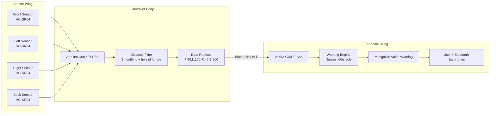
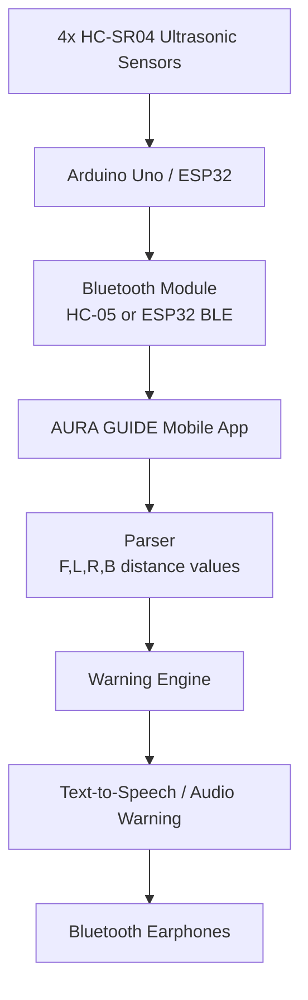
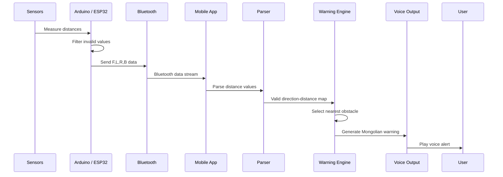
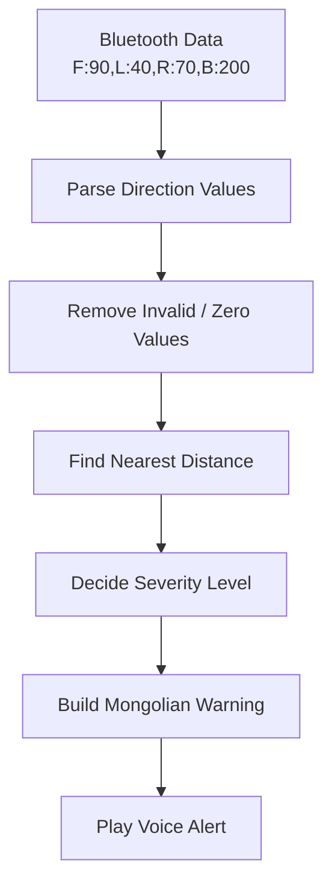

<p align="center">
  
</p>

<h1 align="center">AURA GUIDE</h1>

<p align="center">
  <b>Smart Assistive Hat for Visually Impaired People</b><br/>
  <i>Саадыг түрүүлж мэдэрнэ. Замыг илүү аюулгүй болгоно.</i>
</p>

<p align="center">
  <a href="https://github.com/BeBecpp/Aura_Guide/stargazers">
    
  </a>
  <a href="https://github.com/BeBecpp/Aura_Guide/fork">
    
  </a>
  <a href="https://github.com/BeBecpp/Aura_Guide/issues">
    
  </a>
  <a href="#quick-start">
    
  </a>
</p>

<p align="center">
  
  
  
  
  
  
</p>

---

## Overview

**AURA GUIDE** is a smart assistive wearable prototype designed to help visually impaired users detect nearby obstacles around the upper body and head level.

The system uses **ultrasonic sensors** mounted on a hat or helmet to detect obstacles in four directions:

| Direction | Монгол |
|---|---|
| Front | Урд |
| Left | Зүүн |
| Right | Баруун |
| Back | Ард |

Sensor data is sent to a mobile app through Bluetooth. The app analyzes the nearest obstacle and gives **Mongolian voice warnings** such as:

```text
Урд талд саад байна
Баруун талд ойр саад байна
Зүүн талд маш ойр саад байна
```

> AURA GUIDE is a prototype and concept demonstration. It is not a certified medical or safety device and should not replace a white cane, guide dog, or human assistance.

---

## Why I Built It

I wanted to build a project that connects engineering with a real human problem.

Many assistive devices are expensive, not localized, or not designed with Mongolian language support. AURA GUIDE explores whether a simple wearable system can give obstacle warnings through sensors, Bluetooth communication, and local-language voice feedback.

This project helped me think about more than code:

- hardware and software working together
- real-time sensor data
- Bluetooth communication
- warning prioritization
- accessibility-focused UX
- Mongolian voice feedback
- safety limitations
- demo-ready engineering

AURA GUIDE is one of my most important projects because it combines **hardware, mobile software, accessibility, product thinking, and real-world impact**.

---

## The Problem

For visually impaired people, moving through unfamiliar or crowded spaces can be difficult and risky.

Common challenges include:

| Challenge | Why It Matters |
|---|---|
| Obstacles near head or upper body | A white cane may not detect higher objects |
| Crowded environments | Users may need faster directional awareness |
| Expensive assistive devices | Many advanced devices are not affordable |
| Lack of local language support | Voice feedback should be understandable |
| Complex devices | Assistive tools should be simple and reliable |

AURA GUIDE does not try to replace existing mobility tools.  
It is designed as an **extra awareness layer**.

---

## The Solution

AURA GUIDE is a smart assistive hat prototype.

It uses:

- **4 ultrasonic sensors** for obstacle detection
- **Arduino Uno or ESP32** as the controller
- **HC-05 Bluetooth or ESP32 BLE** for communication
- **Mobile app dashboard** for status and warning display
- **Mongolian voice warning** through phone or Bluetooth earphones
- **Warning engine** that chooses the nearest valid obstacle

---

## Key Features

| Feature | Description |
|---|---|
| 4-direction sensing | Detects obstacles in front, left, right, and back |
| Bluetooth communication | Arduino/ESP32 sends real-time distance data to the app |
| Mongolian voice warning | App warns the user with local-language audio feedback |
| Mobile dashboard | Shows distance values and current warning status |
| Warning engine | Chooses nearest obstacle and severity level |
| Distance filtering | Ignores invalid or unsafe sensor readings |
| Light/Dark theme | UI supports both dark and light modes |
| Branded UI | Healthcare-friendly AURA GUIDE visual identity |
| Demo-ready prototype | Suitable for school, engineering, and innovation demos |
| iOS path | ESP32 BLE version planned for iPhone compatibility |

---

## Butterfly System Scheme

This diagram shows the whole project as a “butterfly style” architecture: hardware on the left wing, mobile/audio feedback on the right wing, and the Bluetooth protocol as the center body.



---

## System Architecture



---

## Runtime Data Flow



---

## Hardware Components

| Component | Quantity | Purpose |
|---|---:|---|
| Arduino Uno / ESP32 | 1 | Main controller |
| HC-SR04 Ultrasonic Sensor | 4 | Detect obstacles in 4 directions |
| HC-05 Bluetooth Module | 1 | Android Bluetooth Classic connection |
| ESP32 BLE | Optional | iPhone/iOS BLE version |
| Jumper Wires | 1 set | Sensor wiring |
| Breadboard / Perfboard | 1 | Circuit assembly |
| Power Bank / Battery | 1 | Portable power supply |
| Switch | 1 | Power control |
| Hat / Helmet | 1 | Wearable mounting structure |
| Android Phone / iPhone | 1 | Mobile app |
| Bluetooth Earphones | 1 | Voice feedback output |

---

## Wiring Scheme — Arduino Uno + HC-05

This is the Android MVP version using HC-05 Bluetooth Classic.

### Sensor Pin Table

| Direction | TRIG Pin | ECHO Pin |
|---|---:|---:|
| Front / Урд | D2 | D3 |
| Left / Зүүн | D4 | D5 |
| Right / Баруун | D6 | D7 |
| Back / Ард | D8 | D9 |

### HC-05 Wiring

| HC-05 Pin | Arduino Pin |
|---|---|
| VCC | 5V |
| GND | GND |
| TXD | Arduino RX |
| RXD | Arduino TX through voltage divider |

> HC-05 RX pin is 3.3V logic. Use a voltage divider between Arduino TX and HC-05 RX.

### ASCII Wiring Diagram

```text
        ┌─────────────────────────────────────┐
        │             AURA GUIDE HAT           │
        └─────────────────────────────────────┘

     [Front HC-SR04]      [Left HC-SR04]      [Right HC-SR04]      [Back HC-SR04]
       TRIG → D2            TRIG → D4            TRIG → D6           TRIG → D8
       ECHO → D3            ECHO → D5            ECHO → D7           ECHO → D9
       VCC  → 5V            VCC  → 5V            VCC  → 5V           VCC  → 5V
       GND  → GND           GND  → GND           GND  → GND          GND  → GND

                                  │
                                  ▼
                           ┌─────────────┐
                           │ Arduino Uno │
                           └─────────────┘
                                  │ Serial
                                  ▼
                           ┌─────────────┐
                           │    HC-05    │
                           │ Bluetooth   │
                           └─────────────┘
                                  │
                                  ▼
                           Android App APK
```

---

## iPhone / ESP32 BLE Version

iPhone apps cannot reliably use **HC-05 Bluetooth Classic SPP** like Android.

For iOS, the recommended setup is:

```text
4x HC-SR04 → ESP32 → BLE → iPhone App
```

Recommended BLE device name:

```text
AURA_GUIDE
```

BLE data remains the same:

```text
F:80,L:150,R:45,B:200
```

---

## Data Protocol

Arduino / ESP32 sends one line of text:

```text
F:80,L:150,R:45,B:200
```

### Direction Keys

| Key | Direction | Монгол |
|---|---|---|
| F | Front | Урд |
| L | Left | Зүүн |
| R | Right | Баруун |
| B | Back | Ард |

### Example

```text
F:80,L:150,R:45,B:200
```

This means:

| Direction | Distance |
|---|---:|
| Front | 80 cm |
| Left | 150 cm |
| Right | 45 cm |
| Back | 200 cm |

The nearest obstacle is:

```text
Right = 45 cm
```

So the app should warn:

```text
Баруун талд ойр саад байна
```

---

## Warning Logic

AURA GUIDE selects the **nearest valid obstacle** and generates the warning message.

| Distance | Severity | UI Status | Voice Message |
|---:|---|---|---|
| 0–40 cm | Very Close | Маш ойр | “маш ойр саад байна” |
| 41–80 cm | Critical | Ойр | “ойр саад байна” |
| 81–120 cm | Warning | Саад | “саад байна” |
| 121+ cm | Safe | Аюулгүй | No sound |
| Invalid / 0 | Ignore | Холболтгүй | No sound |

### Priority Rule

If multiple sensors detect obstacles at the same time, AURA GUIDE chooses the nearest valid distance.

```text
Input:
F:90,L:40,R:70,B:200

Nearest:
L = 40 cm

Output:
Зүүн талд маш ойр саад байна
```

---

## Warning Engine Logic



---

## Mobile App Screens

### 1. Splash / Loading Screen

Shows:

- AURA GUIDE logo
- tagline
- healthcare-style loading experience

```text
AURA GUIDE
Smart Assistive Hat
Саадыг түрүүлж мэдэрнэ
```

### 2. Main Dashboard

Shows:

- Bluetooth status
- current warning
- 4 sensor cards
- connect / disconnect
- settings

```text
AURA GUIDE                          LIVE
Smart Assistive Hat

Bluetooth
HC-05 холбогдсон

ОДООГИЙН АНХААРУУЛГА
Баруун талд ойр саад байна
45 см

┌─────────────┬─────────────┐
│ F Урд       │ L Зүүн      │
│ 80 см       │ 150 см      │
├─────────────┼─────────────┤
│ R Баруун    │ B Ард       │
│ 45 см       │ 200 см      │
└─────────────┴─────────────┘
```

### 3. Settings Screen

Includes:

- light / dark theme
- audio volume
- warning sensitivity
- Bluetooth status
- app info

---

## Brand Identity

### Logo

Recommended logo path:

```text
assets/logo.png
```

Recommended app icon:

```text
assets/app_icon.png
```

### Brand Colors

| Name | HEX | Usage |
|---|---|---|
| Deep Navy | `#050B18` | Dark background |
| Midnight | `#0D1B2A` | Cards and surfaces |
| Teal | `#0EA5A1` | Primary action / safe status |
| Aqua | `#38BDF8` | Accent / technology |
| Amber | `#FFC857` | Warning |
| Coral | `#FF6B6B` | Critical alert |
| White | `#F8FAFC` | Text |

---

## Tech Stack

| Area | Tools / Concepts |
|---|---|
| Hardware | Arduino Uno, ESP32, HC-SR04 sensors |
| Communication | HC-05 Bluetooth Classic, ESP32 BLE |
| Mobile App | Python, Kivy |
| Android Build | Buildozer |
| Warning Logic | Parser, warning engine, severity levels |
| Audio | Mongolian voice feedback / TTS |
| UI | Light/Dark dashboard, sensor cards |
| Prototype Type | Assistive wearable technology |

---

## Project Structure

```text
aura_guide_app/
├── main.py
├── app_config.py
├── parser.py
├── warning_engine.py
├── bluetooth_service.py
├── audio_service.py
├── permissions_helper.py
├── buildozer.spec
├── requirements.txt
├── logo.png
├── assets/
│   ├── logo.png
│   ├── icon.png
│   ├── app_icon.png
│   ├── splash.png
│   └── audio/
├── README.md
├── APK_BUILD_STEPS.md
└── ARDUINO_PROTOCOL.md
```

---

## Quick Start

### Run on PC

```bash
python main.py
```

### Build Android APK

```bash
cd ~/projects/aura_guide_app
source ~/.venvs/buildozer/bin/activate
buildozer -v android debug
```

APK output:

```text
bin/
```

Copy APK to Windows:

```bash
cp bin/*.apk /mnt/d/bebe_personal/
```

---

## Arduino / ESP32 Output Test

Before using the app, confirm your board prints data like this:

```text
F:80,L:150,R:45,B:200
F:82,L:149,R:44,B:201
F:85,L:150,R:45,B:200
```

If the app does not update, check:

- Bluetooth pairing
- correct data format
- newline at the end of each line
- app permissions
- HC-05 baud rate
- sensor power wiring
- stable battery/power supply

---

## Security Notes

AURA GUIDE does not require:

- user login
- cloud server
- internet data upload
- personal database

Security recommendations:

- Change HC-05 default PIN from `1234` / `0000`
- Do not request unnecessary permissions
- Remove `INTERNET` permission if not used
- Use signed release APK for real distribution
- Keep debug APK only for testing
- Do not store personal user data without consent

---

## Testing Checklist

### Hardware

- [ ] Arduino / ESP32 powers on
- [ ] Front sensor works
- [ ] Left sensor works
- [ ] Right sensor works
- [ ] Back sensor works
- [ ] Bluetooth module powers on
- [ ] Power supply is stable
- [ ] Wires are firmly attached
- [ ] Sensors are mounted securely

### Firmware

- [ ] Serial output format is correct
- [ ] Invalid values are ignored
- [ ] Sensors are read one by one
- [ ] Sensor interference is reduced
- [ ] Output updates smoothly

### App

- [ ] App opens successfully
- [ ] Splash screen appears
- [ ] Bluetooth connects
- [ ] Sensor values update
- [ ] Warning message is correct
- [ ] Voice warning works
- [ ] Light/dark theme works
- [ ] App does not crash

### Real Environment

- [ ] Front wall detected
- [ ] Left obstacle detected
- [ ] Right obstacle detected
- [ ] Back obstacle detected
- [ ] Person approaching detected
- [ ] Chair / box detected
- [ ] Corridor test completed
- [ ] False warnings are acceptable
- [ ] Demo flow works

---

## Safety Disclaimer

AURA GUIDE is a prototype assistive technology project.

It does **not** replace:

- white cane
- guide dog
- human guide
- medical/safety-certified mobility device

Limitations:

- Ultrasonic sensors may fail on soft, angled, thin, or glass surfaces.
- Stairs, holes, and low obstacles may not be detected reliably.
- Sensor angle and mounting quality affect accuracy.
- Bluetooth connection may disconnect.
- Battery or power issues can stop the system.
- The prototype should be used only for demos and controlled testing.

Recommended demo explanation:

```text
Энэ бол харааны бэрхшээлтэй хүнд туслах зорилготой prototype бөгөөд одоогоор concept demonstration түвшинд байна.
```

---

## Demo Flow

Recommended demo flow:

| Step | What to Show |
|---|---|
| 1 | Explain the accessibility problem |
| 2 | Show the hat / sensor concept |
| 3 | Show Arduino or ESP32 sending data |
| 4 | Show Bluetooth connection |
| 5 | Show mobile dashboard updating |
| 6 | Move obstacle near one direction |
| 7 | Trigger Mongolian voice warning |
| 8 | Explain safety limitation and future plan |

---

## Demo Script

```text
Манай төслийн нэр AURA GUIDE.

Энэ нь харааны бэрхшээлтэй хүнд ойр орчны саадыг урьдчилан мэдрүүлж,
дуут анхааруулга өгөх smart assistive hat prototype юм.

Малгай дээр 4 ширхэг ultrasonic sensor байрласан:
урд, зүүн, баруун, ард.

Arduino эдгээр sensor-оос зай хэмжиж, Bluetooth module-оор Android app руу data илгээдэг.

App нь data-г real-time уншаад хамгийн ойр байгаа саадыг тодорхойлж,
Bluetooth чихэвчээр Монгол хэлээр анхааруулга өгнө.

Жишээлбэл, баруун талд ойр саад байвал:
“Баруун талд ойр саад байна” гэж хэлнэ.

Энэ prototype нь цагаан таягийг орлохгүй.
Харин ойр орчны саадыг нэмэлтээр мэдрүүлэх concept demonstration юм.
```

---

## What I Learned

While building AURA GUIDE, I learned that assistive technology needs careful design.

The hardest parts were:

- thinking about real user safety
- deciding which obstacle should be prioritized
- parsing real-time Bluetooth data
- designing warning severity levels
- making feedback simple and understandable
- thinking about local language support
- connecting hardware, software, and UX together
- explaining limitations honestly

This project helped me understand that engineering is not only about building something impressive.  
It is also about building something useful, understandable, and human.

---

## Current Limitations

| Limitation | Future Fix |
|---|---|
| Prototype concept stage | Build a stronger physical prototype |
| Limited hardware testing | Test with real sensors more consistently |
| Basic warning logic | Add better smoothing and calibration |
| Bluetooth may disconnect | Add reconnect logic and status alerts |
| No full iOS app yet | Build ESP32 BLE version |
| No vibration feedback yet | Add haptic motor warnings |
| Limited user testing | Get feedback from accessibility groups |
| Voice feedback can improve | Add offline Mongolian voice pack |

---

## Roadmap

- [ ] Better enclosure / 3D printed sensor holders
- [ ] ESP32 BLE version for iPhone
- [ ] Vibration feedback
- [ ] Battery level indicator
- [ ] Emergency button
- [ ] GPS location sharing
- [ ] Fall detection
- [ ] Camera + AI object detection
- [ ] Offline voice pack
- [ ] Release signed APK
- [ ] Real-world testing in controlled environments
- [ ] Accessibility feedback from real users

---

## Team Roles

| Role | Responsibility |
|---|---|
| Hardware Engineer | Sensor wiring, mounting, power |
| Firmware Developer | Arduino/ESP32 code, sensor logic |
| Mobile App Developer | App UI, Bluetooth, warning engine |
| Testing Support | Test log, demo, documentation |

---

## Portfolio Summary

AURA GUIDE is a smart assistive wearable prototype for visually impaired users.

It demonstrates:

- hardware/software integration
- Bluetooth communication
- real-time sensor parsing
- warning engine design
- Mongolian voice feedback
- accessibility-focused UX
- mobile app dashboard design
- safety-aware product thinking
- real-world engineering documentation

This project represents my interest in building technology that is not only smart, but also useful, local, and human.

---

## Support This Project

If you like this project:

<p align="center">
  <a href="https://github.com/BeBecpp/Aura_Guide">
    
  </a>
  <a href="https://github.com/BeBecpp/Aura_Guide/fork">
    
  </a>
  <a href="https://github.com/BeBecpp/Aura_Guide/issues">
    
  </a>
</p>

---

<p align="center">
  <b>AURA GUIDE</b><br/>
  <i>Саадыг түрүүлж мэдэрнэ. Замыг илүү аюулгүй болгоно.</i>
</p>
