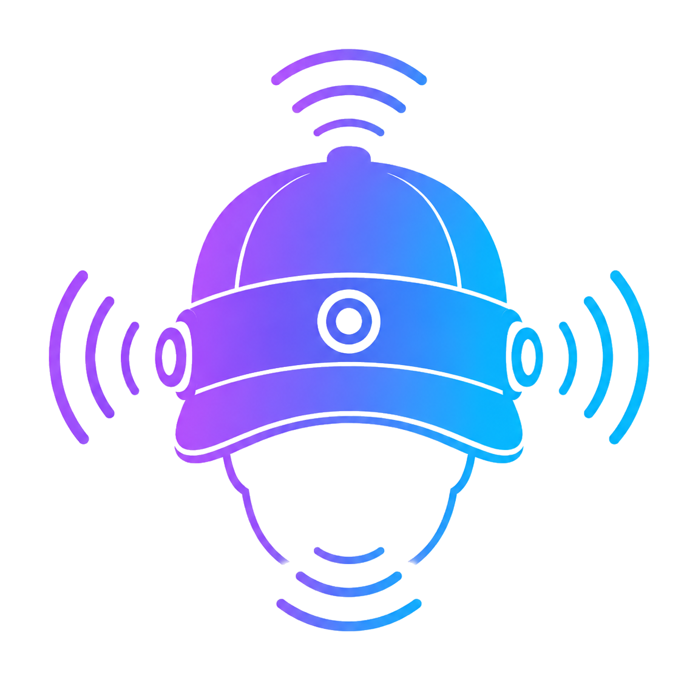
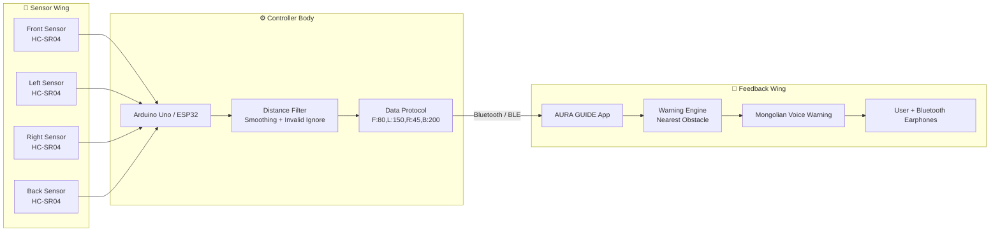
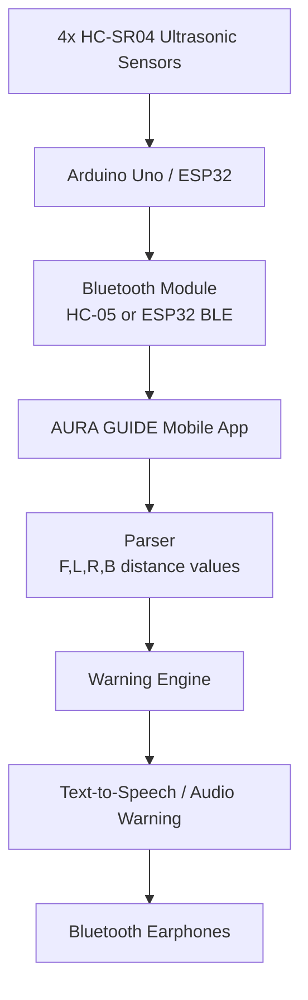

<p align="center">
  
</p>

<h1 align="center">AURA GUIDE</h1>

<p align="center">
  <b>Smart Assistive Hat for Visually Impaired People</b><br/>
  <i>Саадыг түрүүлж мэдэрнэ. Замыг илүү аюулгүй болгоно.</i>
</p>

<p align="center">
  <a href="https://github.com/BeBecpp/Aura_Guide/stargazers">
    
  </a>
  <a href="https://github.com/BeBecpp/Aura_Guide/fork">
    
  </a>
  <a href="https://github.com/BeBecpp/Aura_Guide/issues">
    
  </a>
  <a href="#quick-start">
    
  </a>
</p>

<p align="center">
  
  
  
  
  
</p>

---

## ✨ Overview

**AURA GUIDE** is a smart assistive wearable prototype designed to help visually impaired users detect nearby obstacles around the upper body/head level.

The system uses **ultrasonic sensors** mounted on a hat/helmet to detect obstacles in four directions:

- **Front** — Урд
- **Left** — Зүүн
- **Right** — Баруун
- **Back** — Ард

Sensor data is sent to a mobile app through Bluetooth. The app analyzes the nearest obstacle and gives **Mongolian voice warnings** such as:

```text
Урд талд саад байна
Баруун талд ойр саад байна
Зүүн талд маш ойр саад байна
```

> ⚠️ AURA GUIDE is a prototype and concept demonstration. It is not a certified medical/safety device and should not replace a white cane, guide dog, or human assistance.

---

## 🌟 Key Features

| Feature | Description |
|---|---|
| 🧭 4-direction sensing | Detects obstacles in front, left, right, and back |
| 📡 Bluetooth communication | Arduino/ESP32 sends real-time distance data to the app |
| 🔊 Voice warning | App warns the user with Mongolian voice feedback |
| 📱 Mobile dashboard | Shows distance values and current warning status |
| 🎨 Branded UI | Healthcare-friendly AURA GUIDE theme and logo |
| 🌙 Light/Dark theme | UI supports both dark and light design modes |
| 🧠 Warning engine | Chooses nearest obstacle and severity level |
| 🧪 Demo-ready prototype | Suitable for school, university, engineering, and innovation demos |

---

## 🦋 Butterfly System Scheme

This diagram shows the whole project as a “butterfly style” architecture: hardware on the left wing, mobile/audio feedback on the right wing, and the Bluetooth protocol as the center body.



---

## 🧱 System Architecture



---

## 🔌 Hardware Components

| Component | Quantity | Purpose |
|---|---:|---|
| Arduino Uno / ESP32 | 1 | Main controller |
| HC-SR04 Ultrasonic Sensor | 4 | Detect obstacles in 4 directions |
| HC-05 Bluetooth Module | 1 | Android Bluetooth Classic connection |
| ESP32 BLE | Optional | iPhone/iOS BLE version |
| Jumper Wires | 1 set | Sensor wiring |
| Breadboard / Perfboard | 1 | Circuit assembly |
| Power Bank / Battery | 1 | Portable power supply |
| Switch | 1 | Power control |
| Hat / Helmet | 1 | Wearable mounting structure |
| Android Phone / iPhone | 1 | Mobile app |
| Bluetooth Earphones | 1 | Voice feedback output |

---

## 🧩 Wiring Scheme — Arduino Uno + HC-05

> This is the Android MVP version using HC-05 Bluetooth Classic.

### Sensor Pin Table

| Direction | TRIG Pin | ECHO Pin |
|---|---:|---:|
| Front / Урд | D2 | D3 |
| Left / Зүүн | D4 | D5 |
| Right / Баруун | D6 | D7 |
| Back / Ард | D8 | D9 |

### HC-05 Wiring

| HC-05 Pin | Arduino Pin |
|---|---|
| VCC | 5V |
| GND | GND |
| TXD | Arduino RX |
| RXD | Arduino TX through voltage divider |

> ⚠️ HC-05 RX pin is 3.3V logic. Use a voltage divider between Arduino TX and HC-05 RX.

### ASCII Wiring Diagram

```text
        ┌─────────────────────────────────────┐
        │             AURA GUIDE HAT           │
        └─────────────────────────────────────┘

     [Front HC-SR04]      [Left HC-SR04]      [Right HC-SR04]      [Back HC-SR04]
       TRIG → D2            TRIG → D4            TRIG → D6           TRIG → D8
       ECHO → D3            ECHO → D5            ECHO → D7           ECHO → D9
       VCC  → 5V            VCC  → 5V            VCC  → 5V           VCC  → 5V
       GND  → GND           GND  → GND           GND  → GND          GND  → GND

                                  │
                                  ▼
                           ┌─────────────┐
                           │ Arduino Uno │
                           └─────────────┘
                                  │ Serial
                                  ▼
                           ┌─────────────┐
                           │    HC-05    │
                           │ Bluetooth   │
                           └─────────────┘
                                  │
                                  ▼
                           Android App APK
```

---

## 🍎 iPhone / ESP32 BLE Version

iPhone apps cannot reliably use **HC-05 Bluetooth Classic SPP** like Android. For iOS, the recommended setup is:

```text
4x HC-SR04 → ESP32 → BLE → iPhone App
```

Recommended BLE device name:

```text
AURA_GUIDE
```

BLE data remains the same:

```text
F:80,L:150,R:45,B:200
```

---

## 📡 Data Protocol

Arduino / ESP32 sends one line of text:

```text
F:80,L:150,R:45,B:200
```

### Meaning

| Key | Direction | Монгол |
|---|---|---|
| F | Front | Урд |
| L | Left | Зүүн |
| R | Right | Баруун |
| B | Back | Ард |

### Example

```text
F:80,L:150,R:45,B:200
```

This means:

| Direction | Distance |
|---|---:|
| Front | 80 cm |
| Left | 150 cm |
| Right | 45 cm |
| Back | 200 cm |

The nearest obstacle is **Right = 45 cm**, so the app should warn:

```text
Баруун талд ойр саад байна
```

---

## 🚨 Warning Logic

AURA GUIDE selects the **nearest valid obstacle** and generates the warning message.

| Distance | Severity | UI Status | Voice Message |
|---:|---|---|---|
| 0–40 cm | Very Close | Маш ойр | “маш ойр саад байна” |
| 41–80 cm | Critical | Ойр | “ойр саад байна” |
| 81–120 cm | Warning | Саад | “саад байна” |
| 121+ cm | Safe | Аюулгүй | No sound |
| Invalid / 0 | Ignore | Холболтгүй | No sound |

### Priority Rule

If multiple sensors detect obstacles at the same time, AURA GUIDE chooses the **nearest distance**.

```text
Input:
F:90,L:40,R:70,B:200

Nearest:
L = 40 cm

Output:
Зүүн талд маш ойр саад байна
```

---

## 📱 Mobile App Screens

### 1. Splash / Loading Screen

- Shows AURA GUIDE logo
- Shows tagline
- Healthcare-style loading experience

```text
AURA GUIDE
Smart Assistive Hat
Саадыг түрүүлж мэдэрнэ
```

### 2. Main Dashboard

Shows:

- Bluetooth status
- Current warning
- 4 sensor cards
- Connect / Disconnect
- Settings

```text
AURA GUIDE                          LIVE
Smart Assistive Hat

Bluetooth
HC-05 холбогдсон

ОДООГИЙН АНХААРУУЛГА
Баруун талд ойр саад байна
45 см

┌─────────────┬─────────────┐
│ F Урд       │ L Зүүн      │
│ 80 см       │ 150 см      │
├─────────────┼─────────────┤
│ R Баруун    │ B Ард       │
│ 45 см       │ 200 см      │
└─────────────┴─────────────┘
```

### 3. Settings Screen

Includes:

- Light / Dark theme
- Audio volume
- Warning sensitivity
- Bluetooth status
- App info

---

## 🎨 Brand Identity

### Logo

Place your logo here:

```text
assets/logo.png
```

or:

```text
logo.png
```

Recommended app icon:

```text
assets/app_icon.png
```

### Brand Colors

| Name | HEX | Usage |
|---|---|---|
| Deep Navy | `#050B18` | Dark background |
| Midnight | `#0D1B2A` | Cards and surfaces |
| Teal | `#0EA5A1` | Primary action / safe status |
| Aqua | `#38BDF8` | Accent / technology |
| Amber | `#FFC857` | Warning |
| Coral | `#FF6B6B` | Critical alert |
| White | `#F8FAFC` | Text |

---

## 📂 Project Structure

```text
aura_guide_app/
├── main.py
├── app_config.py
├── parser.py
├── warning_engine.py
├── bluetooth_service.py
├── audio_service.py
├── permissions_helper.py
├── buildozer.spec
├── requirements.txt
├── logo.png
├── assets/
│   ├── logo.png
│   ├── icon.png
│   ├── app_icon.png
│   ├── splash.png
│   └── audio/
├── README.md
├── APK_BUILD_STEPS.md
└── ARDUINO_PROTOCOL.md
```

---

## 🚀 Quick Start

### Run on PC

```bash
python main.py
```

### Build Android APK

```bash
cd ~/projects/aura_guide_app
source ~/.venvs/buildozer/bin/activate
buildozer -v android debug
```

APK output:

```text
bin/
```

Copy APK to Windows:

```bash
cp bin/*.apk /mnt/d/bebe_personal/
```

---

## 🤖 Arduino / ESP32 Output Test

Before using the app, confirm your board prints data like this:

```text
F:80,L:150,R:45,B:200
F:82,L:149,R:44,B:201
F:85,L:150,R:45,B:200
```

If the app does not update, check:

- Bluetooth pairing
- Correct data format
- Newline at the end of each line
- App permissions
- HC-05 baud rate
- Sensor power wiring

---

## 🔒 Security Notes

AURA GUIDE does not require:

- User login
- Cloud server
- Internet data upload
- Personal database

Security recommendations:

- Change HC-05 default PIN from `1234` / `0000`
- Do not request unnecessary permissions
- Remove `INTERNET` permission if not used
- Use signed release APK for real distribution
- Keep debug APK only for testing
- Do not store personal user data without consent

---

## 🧪 Testing Checklist

### Hardware

- [ ] Arduino / ESP32 powers on
- [ ] Front sensor works
- [ ] Left sensor works
- [ ] Right sensor works
- [ ] Back sensor works
- [ ] Bluetooth module powers on
- [ ] Power supply is stable
- [ ] Wires are firmly attached
- [ ] Sensors are mounted securely

### Firmware

- [ ] Serial output format is correct
- [ ] Invalid values are ignored
- [ ] Sensors are read one by one
- [ ] Sensor interference is reduced
- [ ] Output updates smoothly

### App

- [ ] App opens successfully
- [ ] Splash screen appears
- [ ] Bluetooth connects
- [ ] Sensor values update
- [ ] Warning message is correct
- [ ] Voice warning works
- [ ] Light/dark theme works
- [ ] App does not crash

### Real Environment

- [ ] Front wall detected
- [ ] Left obstacle detected
- [ ] Right obstacle detected
- [ ] Back obstacle detected
- [ ] Person approaching detected
- [ ] Chair / box detected
- [ ] Corridor test completed
- [ ] False warnings are acceptable
- [ ] Demo flow works

---

## 🛡️ Safety Disclaimer

AURA GUIDE is a prototype assistive technology project.

It **does not** replace:

- White cane
- Guide dog
- Human guide
- Medical/safety-certified mobility device

Limitations:

- Ultrasonic sensors may fail on soft, angled, thin, or glass surfaces
- Stairs, holes, and low obstacles may not be detected reliably
- Sensor angle and mounting quality affect accuracy
- Bluetooth connection may disconnect
- Battery/power issues can stop the system

Recommended demo explanation:

```text
Энэ бол харааны бэрхшээлтэй хүнд туслах зорилготой prototype бөгөөд одоогоор concept demonstration түвшинд байна.
```

---

## 🗺️ Roadmap

- [ ] Better enclosure / 3D printed sensor holders
- [ ] ESP32 BLE version for iPhone
- [ ] Vibration feedback
- [ ] Battery level indicator
- [ ] Emergency button
- [ ] GPS location sharing
- [ ] Fall detection
- [ ] Camera + AI object detection
- [ ] Offline voice pack
- [ ] Release signed APK

---

## 👥 Team Roles

| Role | Responsibility |
|---|---|
| Hardware Engineer | Sensor wiring, mounting, power |
| Firmware Developer | Arduino/ESP32 code, sensor logic |
| Mobile App Developer | App UI, Bluetooth, warning engine |
| Testing Support | Test log, demo, documentation |

---

## 🎤 Demo Script

```text
Манай төслийн нэр AURA GUIDE.

Энэ нь харааны бэрхшээлтэй хүнд ойр орчны саадыг урьдчилан мэдрүүлж,
дуут анхааруулга өгөх smart assistive hat prototype юм.

Малгай дээр 4 ширхэг ultrasonic sensor байрласан:
урд, зүүн, баруун, ард.

Arduino эдгээр sensor-оос зай хэмжиж, Bluetooth module-оор Android app руу data илгээдэг.

App нь data-г real-time уншаад хамгийн ойр байгаа саадыг тодорхойлж,
Bluetooth чихэвчээр Монгол хэлээр анхааруулга өгнө.

Жишээлбэл, баруун талд ойр саад байвал:
“Баруун талд ойр саад байна” гэж хэлнэ.

Энэ prototype нь цагаан таягийг орлохгүй.
Харин ойр орчны саадыг нэмэлтээр мэдрүүлэх concept demonstration юм.
```

---

## ⭐ Support This Project

If you like this project:

<p align="center">
  <a href="https://github.com/BeBecpp/Aura_Guide">
    
  </a>
  <a href="https://github.com/BeBecpp/Aura_Guide/fork">
    
  </a>
  <a href="https://github.com/BeBecpp/Aura_Guide/issues">
    
  </a>
</p>

---

<p align="center">
  <b>AURA GUIDE</b><br/>
  <i>Саадыг түрүүлж мэдэрнэ. Замыг илүү аюулгүй болгоно.</i>
</p>
